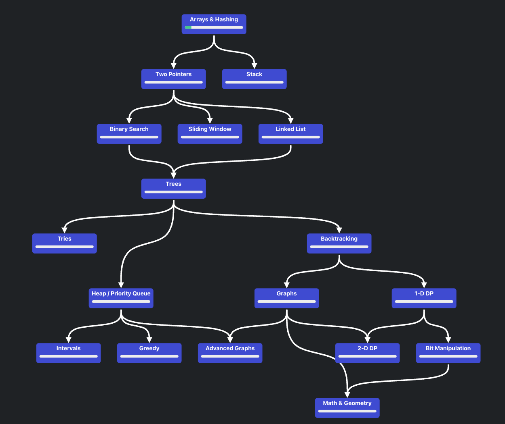

# Notes from traversing the pattern roadmap


# Table of Contents
1. [Arrays and Hashing](#Arrays-and-Hashing)
2. [Two Pointers)](#Two-Pointers)
3. [Stacks](#Stacks)
4. [Binary Search](#binary-search)
5. [Sliding Window](#sliding-window)
6. [Breadth-First Search (BFS)](#breadth-first-search-bfs)
7. [Depth-First Search (DFS)](#depth-first-search-dfs)

# Arrays and Hashing

## two sum
`(찾는 것) or (본 것) -> INDEX`

takeaways
- setting index as a value of a hashmap

## prefix sums
-> cumulative helper array
```python
def fillPrefixSum(arr, n, prefixSum):
    # first element = first element
    prefixSum[0] = arr[0]
 
    # subsequent elements = present + previous element
    for i in range(1, n):
        prefixSum[i] = prefixSum[i - 1] + arr[i]
```

takeaways
- spending O(n) to initialize cumulative array when O(n) was required anyways such to make some consecutive addition calculations trivial
    - sum of 0 to i -> prefixSum[i]
    - sum from i to j -> prefixSum[j] - prefixSum[i-1]


# Two Pointers
## Complexity: O(n)
Three Sum questions are usually two-pointer questions (or 'three-pointer')

Left and right, moving inwards:
```python
def sortedSquares(self, nums: List[int]) -> List[int]:
    res = collections.deque()
    l, r = 0, len(nums) - 1
    while l <= r:
        left, right = abs(nums[l]), abs(nums[r])
        if left > right:
            res.appendleft(left * left)
            l += 1
        else:
            res.appendleft(right * right)
            r -= 1
    return list(res)
```

Both left to right, but one lagging behind (for-loop + variable)
```python
def removeDuplicates(self, nums: List[int]) -> int:        
    j = 1
    for i in range(1, len(nums)):
        if nums[i] != nums[i - 1]:
            nums[j] = nums[i]
            j += 1
    return j
```

Similarly, both left to right, same starting position; (for-loop + nested while-loop)
```python
def numSubarrayProductLessThanK(self, nums: List[int], k: int) -> int:
    if k < 2:
        return 0

    res = 0
    product = 1
    i = 0
    for j in range(len(nums)):
        product = product * nums[j]
        while i <= j and product >= k:
            product = product / nums[i]
            i += 1
        res += (j-i+1)
    return res
```


Three Pointers; one iterating over the iterator, two moving inward in remaining list from left/right
```python
def threeSumSmaller(self, nums: List[int], target: int) -> int:
    nums.sort()
    
    res = 0
    for i, n in enumerate(nums):
        j, k = i+1, len(nums)-1
        while j < k:
            curr_sum = n + nums[j] + nums[k]
            if curr_sum >= target:
                k -= 1
                continue
            res += (k-j)
            j += 1
    return res         
```

# Stacks

Be creative in what the format of the stack's elements to convey more information

e.g., (val, min_uptil_this)
```python
class MinStack:

    def __init__(self):
        self.stk = []

    def push(self, val: int) -> None:
        if len(self.stk) == 0:
            self.stk.append((val, val))
            return
        
        _, min_so_far = self.stk[-1]
        self.stk.append((val, min(min_so_far, val)))

    def pop(self) -> None:
        self.stk.pop()
        
    def top(self) -> int:
        val, _ = self.stk[-1]
        return val

    def getMin(self) -> int:
        _, curr_min = self.stk[-1]
        return curr_min
```

Think about what characteristic or trend your stack displays (e.g., at any point, the stack will contain temperatures in increasing order where max_temp is top)

(no need to use heapq to enforce this if using stacks in a particular way guarantees this trend)
```python
def dailyTemperatures(self, temperatures: List[int]) -> List[int]:
    stk = []
    res = [0 for _ in temperatures]

    for i, t in enumerate(temperatures):
        while len(stk) > 0 and stk[-1][0] < t:
            _, j = stk.pop()
            res[j] = i-j
        stk.append((t, i))

    return res
```


# Binary Search

When? 

- You need to choose a solution from some **defined range** that is optimal, where testing out one input can **narrow down** the range
- Input (range) is **sorted** (hist, matrix)


```python
# lo represents the lowest possible idx output
# hi represents the highest possible idx output

# Find index of target in a sorted array
# left-most idx & where it should be (even if non-existent)
def binary_search(array) -> int:
    def condition(value) -> bool:
        pass

    left, right = min(search_space), max(search_space) # could be [0, n], [1, n] etc. Depends on problem
    while left < right:  # < 
        mid = left + (right - left) // 2
        if condition(mid):
            right = mid    # 해답이라면
        else:
            left = mid + 1 # 위로 올라가
    return left
```

```python
def find_leftmost(self, nums, target):
    lo, hi = 0, len(nums)-1
    while lo < hi:  # after this loop, lo == hi
        mid = lo + (hi-lo)//2
        if nums[mid] >= target:
            hi = mid
        else:
            lo = mid + 1
    return lo if nums[lo] == target else -1


def find_rightmost(self, nums, target):
    lo, hi = 0, len(nums)-1
    while lo < hi:
        mid = lo + (hi-lo)//2 + 1  # only diff! (~ceil bias)
        if nums[mid] <= target:
            lo = mid
        else:
            hi = mid - 1  # high가 내려옴.
    return lo if nums[lo] == target else -1
    

# return -1 if not exists
def binary_search_equality(nums: List[int], target: int) -> int:
    lo, hi = 0, len(nums)-1
    while lo <= hi:  # INCLUSIVE to check all possible vals for equality
        mid = (lo + hi) // 2
        print(f"{lo=}, {hi=}, {mid=}")
        if nums[mid] < target:
            lo = mid + 1
        elif nums[mid] > target:
            hi = mid - 1
        else:
            return mid
    return -1

# 또는 위 func 그냥 써도 될 듯.
```

## bisect.bisect_left/right

In questions where binary search implementation is not the main objective, consider using bisect library to call binary search with ease.

```python
def find_left(self, nums, target):
    leftmost_idx = bisect.bisect_left(nums, target)
    return leftmost_idx if 0<=leftmost_idx<len(nums) and nums[leftmost_idx] == target else -1

def find_right(self, nums, target):
    right_of_rightmost_idx = bisect.bisect_right(nums, target)
    rightmost_idx = right_of_rightmost_idx - 1
    return rightmost_idx if 0 <= rightmost_idx<len(nums) and nums[rightmost_idx] == target else -1
```

# Sliding Window
> *Longest/Shortest Sub-array, substring, etc...; continguous sequence...* ➡️💡 sliding window!

## standard idea for algorithm (e.g., min subarray)
1. Use two pointers: start and end to represent a window.
2. Move end to find a valid window.
3. When a valid window is found, move start to find a smaller window.

Impl A. for-loop & while

- start is marker for start, and end is the pointer that adds the element to the substring 
    - When start moves right, it subtracts elements. When end moves, it adds elements.
    - Think of them as subtractor and adder.
- usually end moves incrementally, and start pointer hurries forward looking for valid/shorter solution. One pointer that steadily moves can be managed by the for-loop and the catch-up pointer can be handled by the nested while-loop

```python
def lengthOfLongestSubstringKDistinct(self, s: str, k: int) -> int:
    self.window_counter = defaultdict(int)
    self.uniq_count = 0

    start, res = 0, 0
    for end in range(len(s)):
        self.add_to_substring(s[end])
        
        while not self.is_valid(k):
            self.remove_from_substring(s[start])
            start += 1
        
        res = max(res, end-start+1)
    return res
```

Impl B. (while-while)

- don't complicate, make each while-loop increment a pointer by one.
- boundaries: start, end (inclusive, exclusive) -> where if start=end, exclusive takes priority

```python
MAX_SIZE = 100001

def minSubArrayLen(self, target: int, nums: List[int]) -> int:
    res = self.MAX_SIZE
    i, j, window_sum = 0, 0, 0

    while j < len(nums):
        window_sum += nums[j]
        j += 1

        while window_sum >= target:
            res = min(res, j-i)
            window_sum -= nums[i]
            i += 1

    return res if res != self.MAX_SIZE else 0
```

This can be converted to above form by moving the j+=1 to the bottom of the while-loop and adjusting the res update line. 

```python
MAX_SIZE = 100001

def minSubArrayLen(self, target: int, nums: List[int]) -> int:
    res = self.MAX_SIZE
    i, j, window_sum = 0, 0, 0

    while j < len(nums):
        window_sum += nums[j]

        while window_sum >= target:
            res = min(res, j-i+1)  # ADJUST
            window_sum -= nums[i]
            i += 1
        
        j += 1  # MOVE HERE

    return res if res != self.MAX_SIZE else 0
```

Now you can see this is identical as a for-loop implementation:
```python
def minSubArrayLen(self, target: int, nums: List[int]) -> int:
    res = self.MAX_SIZE
    i, window_sum = 0, 0

    for j in range(len(nums)):
        window_sum += nums[j]

        while window_sum >= target:
            res = min(res, j-i+1)
            window_sum -= nums[i]
            i += 1
    
    return res if res != self.MAX_SIZE else 0
```

You can even name the pointers `adder`, `subtractor` if it makes more sense to you.
```python
def totalFruit(self, fruits: List[int]) -> int:
    subtractor, res = 0, 0
    fruit_count = defaultdict(int)

    for adder in range(len(fruits)):
        fruit_count[fruits[adder]] += 1
        adder += 1

        while len(fruit_count) > 2:
            fruit_count[fruits[subtractor]] -= 1
            if fruit_count[fruits[subtractor]] == 0:
                del fruit_count[fruits[subtractor]]
            subtractor += 1
        
        # at this point, it is valid
        res = max(res, adder - subtractor)
    return res
``` 

You might need to check your chosen DS both before and after the addition to identify whether your current substring is valid. No fret!

Also, if O(n) is still inefficient, consider making your start pointer JUMP (direct assignment to earliest valid-substring start loc; `START = X`) instead of iteratively increase by 1 (`WHILE .. start+=1`)

```python
def lengthOfLongestSubstring(self, s: str) -> int:
    start, res = 0, 0
    char_seen_at = {}
    for end in range(len(s)):
        prev_seen = char_seen_at.get(s[end], -1)
        char_seen_at[s[end]] = end

        # make valid / find optimal with this end
        if prev_seen >= start:
            start = prev_seen+1
        
        res = max(res, end-start+1)
    return res
```

You can separate _is_valid helper function to increase readability
```python
def _is_valid(self, counter: Dict, k_threshold: int) -> bool:
    counts = counter.values()
    return sum(counts) - max(counts) <= k_threshold

def characterReplacement(self, s: str, k: int) -> int:
    counter = defaultdict(int)
    start, res = 0, 0
    for end in range(len(s)):
        counter[s[end]] += 1
        while not self._is_valid(counter, k) and start < len(s):
            counter[s[start]] -= 1
            start += 1
        res = max(res, end-start+1)
    return res        
```

Complex Impl: Efficiency

You may make the fixed window grow in size and shift each time.
```python
def longestOnes(self, nums: List[int], k: int) -> int:
    i = 0
    for j in range(len(nums)):
        k -= (1-nums[j])
        if k < 0:
            k += (1-nums[i])
            i += 1
    return j-i+1
```

Notice there is no while-loop here or a logic to make i move to the num that makes the interval valid. It just carries on checking if it would come across another substring/window of length X that is vaild/invalid.


# Breadth-First Search (BFS)

**QUEUE** which at any given time contains nodes belonging to same level

- while q is not empty
- pop from q, N times where len(q) = N
- do operation; append its children if exists

```python
def minDepth(self, root: Optional[TreeNode]) -> int:
    if root is None:
        return 0
    
    q = deque()
    q.append(root)
    level = 0
    while len(q) > 0:
        level += 1
        level_node_count = len(q)
        for i in range(level_node_count):
            n = q.popleft()
            if n.left is None and n.right is None:
                return level
            if n.left is not None:
                q.append(n.left)
            if n.right is not None:
                q.append(n.right)
    return -1
```


# Depth-First Search (DFS)

**STACK** (or recursion)

```python
def isValidSequence(self, root: Optional[TreeNode], arr: List[int]) -> bool:
    def dfs(node, i):
        if node is None or i >= 0:
            return False

        if i == -1:
            if node.val == arr[i] and node.left is None and node.right is None:
                return True
            return False

        if node.val != arr[i]:
            return False
        
        return dfs(node.left, i+1) or dfs(node.right, i+1)
    return dfs(root, -1*len(arr))


def isValidSequence(self, root: Optional[TreeNode], arr: List[int]) -> bool:
    stk = []
    stk.append((root, -1*len(arr)))
    while len(stk) > 0:
        node, i = stk.pop()
        if node is None or i >= 0:
            continue

        if i == -1:
            if node.val == arr[i] and node.left is None and node.right is None:
                return True
            continue

        if node.val != arr[i]:
            continue
        
        stk.append((node.left, i+1))
        stk.append((node.right, i+1))
    return False
```

# Trie (Prefix Tree)

## Classic Trie

```python
class TrieNode:
    """
    TrieNode need not know about the char/int it represents.
    Just know your children's identity (and whether you are the end of a word).

    Remember: IS_WORD (BOOL) & CHILDREN (DICT)
    """
    def __init__(self):
        self.is_word = False
        self.children = {}

class Trie:
    def __init__(self):
        self.root = TrieNode()  # KEY: Start with a default TrieNode
    
    def insert(self, word: str):
        node = self.root
        for c in word:
            if c not in node.children:
                # create new nodes if necessary
                node.children[c] = TrieNode()
            # could replace above if-statement block with: 
            #  node.children.setdefault(c, TrieNode())
            node = node.children[c]
        node.is_word = True
    
    def search(self, word):
        node = self.root
        for c in word:
            if c not in node.children:
                return False
            node = node.children[c]
        return node.is_word
    
    def startsWith(self, prefix):
        node = self.root
        for c in prefix:
            if c not in node.children:
                return False
            node = node.children[c]
        return True
```

## Bin's Trie
My version of trie functionality implementation (not following trie structure).

Time complexity
- Insert: O(n) where n = len(word)
- Search: O(1)
- StartsWith: O(1)

Takes a little bit more memory though (e.g., a, ab, abc, abcd would be able to be represented by the same 4 nodes required for abcd in traditional trie but below approach creates an entry each in `added` set. minor space tradeoff in my opinion)

However, it doesn't support key features like autocomplete (or tree structure of possibilities in the middle of a word)
```python
class Trie:
    def __init__(self):
        self.added = set()
        self.prefixs = set()
    
    def insert(self, word: str):
        self.added.add(word)
        for i in range(1, len(word)+1):
            self.prefixs.add(word[:i])
    
    def search(self, word):
        return word in self.added
    
    def startsWith(self, prefix):
        return prefix in self.prefixs
```

Concise implementation just to build it from an array.

```python
class TrieNode:
    def __init__(self):
        self.is_word, self.words, self.children = False, [], {}
    
    @staticmethod
    def build_trie(words):
        root = TrieNode()
        for w in words:
            node = root
            for c in w:
                node.children.setdefault(c, TrieNode())
                node.children[c].words.append(w)
                node = node.children[c]
            node.is_word = True
        return root
```


# Dynamic Programming

tip: use `@cache` when you can
```python
from functools import cache

def maxSubArray(self, nums: List[int]) -> int:
    @cache
    def solve(i, must_pick):
        if i >= len(nums): return 0 if must_pick else -inf
        return max(nums[i] + solve(i+1, True), 0 if must_pick else solve(i+1, False))
    return solve(0, False)
```

# Reverse Linked List

```python
def reverseList(self, head: Optional[ListNode]) -> Optional[ListNode]:
    prev = None
    curr = head
    while curr is not None:
        next = curr.next
        curr.next = prev
        prev = curr
        curr = next
    return prev
```


# Heaps

default for heapq is minimum heap (where peak/top returns minimum). To make max-heap, transform with x(-1).

You can attach additional data to the heap item using tuple which is sorted by the first key.

```python
def kClosest(self, points: List[List[int]], k: int) -> List[List[int]]:
    # heap item: (euc_dist, x, y)
    dist_annotated_points = []
    for p in points:
        euc_dist = (p[0]**2 + p[1]**2)**0.5
        dist_annotated_points.append((euc_dist, p[0], p[1]))
    
    heapq.heapify(dist_annotated_points)

    res = []
    for _ in range(k):
        dist, x, y = heapq.heappop(dist_annotated_points)
        res.append([x, y])
    return res
```